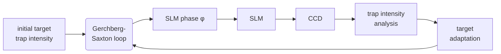

# 光阱阵列制备技术报告

## 一、 光阱阵列制备技术简介

中性原子体系用于量子计算的一个显著优势在于原子阵列具有很强的可拓展性，而这种可扩展性需要依赖原子阵列的高效制备才能够体现。目前原子阵列的实现主要有两种途径，第一种是通过光阱阵列制备技术。光阱阵列制备技术指的是将激光通过特定的光学器件调制后经过强聚焦透镜组形成光偶极阱阵列的技术，其中每个偶极阱都能用来囚禁单原子乃至原子系综，符合条件的光学器件包括空间光调制器 (Spatial Light Modulator, SLM)、声光偏转器(Acousto Optical Deflector, AOD)等等。此外，原子阵列也可以通过对射激光干涉效应形成的周期分布的光晶格来实现，冷却到 BEC 的原子被装载在驻波场形成的光晶格的格点中。本文主要介绍通过空间光调制器来生成光偶极阱阵列的技术，相比其他方法其最大的优势在于原子阵列排布的灵活性，即原子几乎可以以预定义好的任意二维构型进行排布。

## 二、 光阱阵列制备技术方案

## 2.1 用空间光调制器生成二维光阱阵列

SLM 是由双折射液晶组成的像素阵列，类似于液晶显示器中所使用的液晶。每个像素可以对反射光场引入一个偏振依赖的相移，并且可以独立地控制每个像素引入的相移大小。通过在每个像素点对反射光场引入合适的相移，我们能够任意的调节反射光在透镜焦平面的强度分布。因此，问题的关键在于如何找到合适的相位使反射光在透镜焦平面能产生我们需要的强度分布模式。Gerchberg-Saxton(GS)算法是一种能够根据目标光强分布来计算相位图的通用算法。但需要注意的是，由于 SLM 只能调制光场的相位分布，无法改变入射的振幅分布，所以透镜焦平面的光强分布不可能跟目标光强分布完全相同，只可能尽量接近目标光强分布。另外，由于算法过程是完全确定的，最终迭代出的相位分布只跟初始设置的相位分布相关，初始相位分布的随机性会导致最终相位的分布并不唯一。

与一些直接算法相比，GS 算法在计算全息相位图、生成任意构型的光阱上具有光强的利用率较高的优势，但是缺点在于生成的光阱的均匀性非常有限。针对这个问题，已经有学者在 GS 算法的基础上进行了改进，得到了 Weighted Gerchberg-Saxton(WGS)算法和 Generalized Adaptive Additive(GAA)算法等。

## 2.2 修正波前畸变

当光阱阵列的规模逐渐变大时，光束质量会由于波前畸变而显著下降。这种波前畸变通常是由于光学元器件表面或镀膜的光学均匀性有限所导致。这种畸变会影响束腰处光斑的峰值功率，减小原子感受到的光频移，从而限制我们的光阱阵列规模；波前畸变还会显著影响束腰处光斑的尺寸和形状，从而影响光阱之间的最小间距。此外，全息图的计算是基于具有平整波前的高斯光束而言，因此波前畸变会导致全息图的质量下降。基于这些原因，对波前畸变进行修正是非常有必要的。在 SLM 平面上，波前畸变可以理解为波前相位的偏差，所以对波前畸变的修正可以简单的通过 SLM 来完成。

除了由于光学元件引入的波前畸变之外，SLM 屏幕表面的不平整也会引入额外的波前畸变。尽管我们在计算相位图时假定 SLM 屏幕是一个完美的平面，但是实际上由于制造商的加工公差，实际的 SLM 屏幕是存在一定的不平整度的。有的 SLM 制造商在出厂 SLM 时也会附上用于修正 SLM 屏幕表面不平整度的相位图。修正方式同样是将厂家提供的相位添加到计算好的相位图中，即：

$$\varphi_{total} = \varphi_{array} + \varphi_{aberration} + \varphi_{factory}$$

## 2.3 优化光阱阵列的均匀性

在考虑了 SLM 表面平整度以及光学元件引入的波前畸变后，采用 GS 算法进行迭代得

到的光阱阵列的阱深仍然是非常不均匀的，这种不均匀性可能来自于光在 SLM 屏幕上衍射效率的不均匀性或者 GS 算法本身的限制。对于前者，我们可以考虑引入反馈回路对目标光强分布来进行修正，对于后者我们可以考虑采用 WGS 等改进算法。光阱阵列的不均匀性对后续的实验具有非常大的影响，对于阱深偏大的光阱，原子感受到的光位移也偏大，这就导致后续对该原子的冷却效果变差、探测过程中放出的光子数变少等问题；而阱深偏小的光阱对原子的束缚能力有限，原子可能在实验结束后没能重新被阱抓住导致原子的损失。所以，优化光阱阵列的均匀性对后续的实验来说非常重要。

(a)

(b)
<table>
  <thead>
    <tr>
        <th>normalised intensity (arb. units)</th>
        <th>occurrences</th>
    </tr>
  </thead>
  <tbody>
    <tr>
        <td>0.0</td>
        <td>0</td>
    </tr>
    <tr>
        <td>0.2</td>
        <td>0</td>
    </tr>
    <tr>
        <td>0.4</td>
        <td>0</td>
    </tr>
    <tr>
        <td>0.6</td>
        <td>2</td>
    </tr>
    <tr>
        <td>0.7</td>
        <td>4</td>
    </tr>
    <tr>
        <td>0.8</td>
        <td>6</td>
    </tr>
    <tr>
        <td>0.9</td>
        <td>5</td>
    </tr>
    <tr>
        <td>1.0</td>
        <td>8</td>
    </tr>
    <tr>
        <td>1.1</td>
        <td>7</td>
    </tr>
    <tr>
        <td>1.2</td>
        <td>8</td>
    </tr>
    <tr>
        <td>1.3</td>
        <td>4</td>
    </tr>
    <tr>
        <td>1.4</td>
        <td>2</td>
    </tr>
  </tbody>
</table>

(c)
<table>
  <thead>
    <tr>
        <th>normalised intensity (arb. units)</th>
        <th>occurrences</th>
    </tr>
  </thead>
  <tbody>
    <tr>
        <td>0.0</td>
        <td>0</td>
    </tr>
    <tr>
        <td>0.2</td>
        <td>0</td>
    </tr>
    <tr>
        <td>0.4</td>
        <td>0</td>
    </tr>
    <tr>
        <td>0.6</td>
        <td>0</td>
    </tr>
    <tr>
        <td>0.8</td>
        <td>0</td>
    </tr>
    <tr>
        <td>0.9</td>
        <td>13</td>
    </tr>
    <tr>
        <td>1.0</td>
        <td>45</td>
    </tr>
    <tr>
        <td>1.1</td>
        <td>2</td>
    </tr>
    <tr>
        <td>1.2</td>
        <td>0</td>
    </tr>
    <tr>
        <td>1.4</td>
        <td>0</td>
    </tr>
  </tbody>
</table>

图 1. 优化光阱阵列的阱深均匀性。(a)优化阱深均匀性的反馈回路。(b)优化前和优化后的归一化光强分布。

图片来源为 2016 年 Henning Labuhn 的博士论文。

我们可以采用一个 CCD 相机来优化阱深均匀性，如图 1 所示。我们首先采用均匀的光阱阵列作为目标光强分布，采用 GS 算法或者前面提到的改进算法计算出对应的相位图，经过若干次往返迭代后，等到算法收敛时，我们暂停算法并把相图加载到 SLM 上，通过 CCD 相机记录每个阱实际的光强分布。根据 CCD 相机采集的结果，我们对目标光强分布进行调整：对于实际光强较弱的阱，提高目标光强分布中该阱的光强；对于实际光强过强的阱，降低目标光强中该阱的光强。然后，我们就能根据修正后的目标光强分布继续采用算法进行迭代，直到最终在 CCD 相机上得到具有较好均匀性的光阱阵列。整个优化流程，包括采用算法进行迭代、通过 CCD 相机采集实际光强分布、根据实际光强分布对目标光强分布进行修正、采用修正后的目标光强分布继续进行迭代这一系列步骤，都能够通过计算机自动完成。

光阱阵列的均匀性优化完成后，可以采用 CCD 相机来标定此时光阱的均匀性。但是，由于 CCD 相机放在真空腔外，光阱阵列从原子处到 CCD 相机还需要经过一系列光学元件，从而引入额外的波前畸变，对每个光阱的阱深产生不同的影响，因此 CCD 相机处看到的光阱均匀性并不等同于原子真实感受到的阱深的均匀性。最准确的标定阱深均匀性的方式是通过原子的光频移进行标定，将在下一小节进行详细介绍。

## 2.4 用原子光频移标定光阱阵列的阱深均匀性

光阱对于原子的囚禁作用是通过 AC-Stark 效应来实现的，原子能级在特定波长的激光作用下由于 AC-Stark 效应发生位移，也被称为光频移。利用这一点，我们可以通过精密光谱学手段测量光阱阵列中各原子的某一特定跃迁线的光频移，进而标定阱深。在铷 87 原子中，我们选择 D1 线（795 nm 波长）的 $F=2 \rightarrow F'=2$ 超精细跃迁作为标定光频移的跃迁线。

实验中我们将阱内的原子先泵浦到处于基态 F=2，对于被阱产生了光频移的这条跃迁线越共振的激光可以实现越好的回泵效果，将原子重新泵浦到 F=1。通过扫描激光的频率并测量被重新泵浦到 F=1 的原子的比例得到的谱线可以测量得到阱内原子感受到的光频移。

# 三、 光阱阵列制备技术研究进展

### 3.1 Gamma 曲线的测量与校正

SLM 的 gamma 曲线是指写入 SLM 的灰度值与被调制的激光实际受到的相位改变的关系。如果 gamma 曲线与理想状态差异较大，会导致加载相位图的实际效果大打折扣。我们通过给 SLM 的左右半屏分别加载恒定为 0 的灰度值和从 0 扫描到 255 的灰度值，将一束准直激光分成两束分别打到两个半屏上再用透镜将这两束平行的准直光合束做干涉，在

灰度值从 0 扫描到 255 的过程中可以看到干涉条纹的移动，进而反推出被调制的激光实际受到的相位改变的大小。Holoeye 公司的 SLM 自带 gamma 曲线校准软件，将扫描灰度值得到的 256 张干涉条纹的图片中提取出干涉对比度最高的一行像素并拼接成一张 256 行像素的图片，然后导入软件中，可以自动分析生成 gamma 曲线。

The image shows a grayscale interference pattern with wavy, alternating dark and light fringes, representing the data before calibration.

图 2. 校准前图片

将上述测到的 gamma 曲线对应的修正用 LUT 导出，由于毛刺较多，用三次函数做了拟合处理，然后再重新导出一份 LUT 的拟合结果，加载到 SLM 上，以完成校准。

The image shows a grayscale interference pattern similar to the previous one but with smoother, more regular fringes, representing the data after calibration.

图 3. 校准后图片

## 3.2 808 nm 光阱阵列光路

[The image shows an optical path diagram for an 808 nm optical trap array. It includes various optical components such as lenses, mirrors, polarizing beam splitters (PBS), acousto-optic deflectors (AOD), and a spatial light modulator (SLM). The diagram illustrates three main input paths: "808 阵列" (808 array), "808 挪原子" (808 atom moving), and a fluorescence collection path labeled "荧光收集". A green component at the top represents a high NA objective lens.]

上图为我们设计的 808 nm 光阱阵列光路，其中绿色部分为高 NA 物镜（三丰，378-848-3）。三丰物镜处的入射光包括阵列光、用于挪原子的光以及单束光阱。阵列光入射后通过波片和偏振分光棱镜(PBS)进行功率稳定，然后通过 SLM 进行相位调制生成阵列光，然后用 PBS 合光之后经过缩束系统进入三丰物镜。用于挪原子的光和单束光阱同样是通过 PBS 合束后与阵列光进行合束，其中用于挪原子的光镊是通过两个方向的一维声光偏转器(AOD)生成。三丰物镜前放置了一个双色镜(DM)用于将 780 nm 的荧光反射出来，然后用 EMCCD 相机收集用于成像。

## 3.3 波前畸变修正效果

我们按照 2.2 中所述的方式对 SLM 处的波前进行修正。由于采用原子光频移标定一遍阱深耗时太久，我们先粗略的以 0.05 waves 或 0.1 waves 的目测精度将主要的几项 Zernike 多项式进行了修正，使得 sCMOS 相机上的光斑的峰值光强最大，修正前后的效果如图 5 所示。可以看到，修正后 sCMOS 相机上的光斑的峰值功率 (ROI 5) 从 9600 左右变为约 16500，提升接近一倍。此外，光阱形状也有了明显的优化，修正前的光斑存在严重拖尾，修正后的光斑得到了明显改善，更加接近理想的高斯光束。我们把用于修正的 Zernike 多项式直接加载到 SLM 屏幕上，得到了最终的波前修正图。

(a)
The image shows a screenshot of a software interface displaying a 2D array of light spots (optical trap array) captured by an sCMOS camera before correction. To the right of the image, there are tables showing statistical data for different Regions of Interest (ROI).
- **Counts Plot**: Shows a grid of red spots on a dark background.
- **Data Tables**:
    - **Mean**: Displays mean intensity values for various ROIs across multiple columns (Sci1, 2, 3, 4, 5).
    - **Maximum**: Displays peak intensity values. For ROI 5, the values are around 9600 (e.g., 9594, 9604, 9644, 9719, 9744).
    - **Total Counts**: Displays integrated intensity values.
- **ROI Info**: ROI-5 (left: 778, bottom: 434, width: 350, height: 114).

(b)
The image shows the same optical trap array after wavefront correction.
- **Counts Plot**: The spots appear brighter and more symmetric compared to image (a).
- **Data Tables**:
    - **Maximum**: For ROI 5, the peak intensity values have increased significantly to around 16500 (e.g., 16653, 16678, 16467, 16359, 16176).
- **ROI Info**: ROI-5 (left: 778, bottom: 434, width: 350, height: 114).
- **Exposure Time**: Min: 0.000025 Max: 0.014864.

图 5. 修正前后用 sCMOS 相机拍到的光阱阵列。

# 3.4 不均匀度优化效果

我们按照 2.3 小节对不均匀度进行迭代优化后，分别采用 sCMOS 相机和原子光频移的方式对 48 个原子组成的 4*12 的原子阵列的不均匀性进行了标定。sCMOS 相机的标定方式是编写程序对 sCMOS 采集的数据进行处理，自动识别每个光阱的位置以及对应的光电子计数，通过每个光阱的光电子计数来计算不均匀度；原子光频移的标定方式为分别测量阱深为 $2\text{ mK}$ 左右（根据光功率估算）的阱内和自由空间内各个原子的 D1 线的 $F=2 \rightarrow F'=2$ 超精细跃迁的共振频率，作差得到 D1 线的差分光位移，然后根据 $5S_{1/2}$ 和 $5P_{1/2}$ 的动态极化率的比例关系计算出基态光位移，得到阱深的不均匀度。用 sCMOS 相机和原子光频移分别标定光阱阵列的阱深均匀性的结果如图 6 所示。根据结果计算出用 sCMOS 相机标定的不均匀度为 $0.5\%$，用原子光频移标定的不均匀度为 $4.35\%$。那么我们可以估算出由成像系统引入的不均匀度不超过 $\sqrt{0.0435^2 + 0.005^2} = 0.0438$。

The image shows a $4 \times 12$ optical trap array captured by a camera, with each trap numbered from 1 to 48.

### Histogram

<table>
  <thead>
    <tr>
        <th>基态阱深(mK)</th>
        <th>Occurrence</th>
    </tr>
  </thead>
  <tbody>
    <tr>
        <td>[2.1218, 2.199]</td>
        <td>9</td>
    </tr>
    <tr>
        <td>(2.199, 2.2762]</td>
        <td>14</td>
    </tr>
    <tr>
        <td>(2.2762, 2.3534]</td>
        <td>12</td>
    </tr>
    <tr>
        <td>(2.3534, 2.4306]</td>
        <td>9</td>
    </tr>
    <tr>
        <td>(2.4306, 2.5078]</td>
        <td>4</td>
    </tr>
  </tbody>
</table>

图 6. 用 sCMOS 相机和原子光频移分别标定 4*12 的光阱阵列的阱深均匀性

由于 808 nm 激光器功率限制，我们暂时无法生成阱深足够用来装载原子的 15*15 的光阱阵列，因此无法用原子光频移的方式来标定其不均匀度。我们这里采用了 sCMOS 相

机来标定 $15*15$ 的光阱阵列的不均匀度，如图 7 所示。根据结果计算出 sCMOS 相机标定的不均匀度为 $0.9\%$。根据误差传递公式，我们可以估算用原子光频移的方式标定出的光阱阵列的不均匀度不超过 $\sqrt{0.0438^2 + 0.009^2} = 0.0447$。

The image shows a $15 \times 15$ grid of optical traps, each represented by a small square containing a bright spot. The traps are numbered from 1 to 225, starting from the bottom-left corner and increasing row by row to the top-right corner.

<table>
  <tbody>
    <tr>
        <td>211</td>
        <td>212</td>
        <td>213</td>
        <td>214</td>
        <td>215</td>
        <td>216</td>
        <td>217</td>
        <td>218</td>
        <td>219</td>
        <td>220</td>
        <td>221</td>
        <td>222</td>
        <td>223</td>
        <td>224</td>
        <td>225</td>
    </tr>
    <tr>
        <td>196</td>
        <td>197</td>
        <td>198</td>
        <td>199</td>
        <td>200</td>
        <td>201</td>
        <td>202</td>
        <td>203</td>
        <td>204</td>
        <td>205</td>
        <td>206</td>
        <td>207</td>
        <td>208</td>
        <td>209</td>
        <td>210</td>
    </tr>
    <tr>
        <td>181</td>
        <td>182</td>
        <td>183</td>
        <td>184</td>
        <td>185</td>
        <td>186</td>
        <td>187</td>
        <td>188</td>
        <td>189</td>
        <td>190</td>
        <td>191</td>
        <td>192</td>
        <td>193</td>
        <td>194</td>
        <td>195</td>
    </tr>
    <tr>
        <td>166</td>
        <td>167</td>
        <td>168</td>
        <td>169</td>
        <td>170</td>
        <td>171</td>
        <td>172</td>
        <td>173</td>
        <td>174</td>
        <td>175</td>
        <td>176</td>
        <td>177</td>
        <td>178</td>
        <td>179</td>
        <td>180</td>
    </tr>
    <tr>
        <td>151</td>
        <td>152</td>
        <td>153</td>
        <td>154</td>
        <td>155</td>
        <td>156</td>
        <td>157</td>
        <td>158</td>
        <td>159</td>
        <td>160</td>
        <td>161</td>
        <td>162</td>
        <td>163</td>
        <td>164</td>
        <td>165</td>
    </tr>
    <tr>
        <td>136</td>
        <td>137</td>
        <td>138</td>
        <td>139</td>
        <td>140</td>
        <td>141</td>
        <td>142</td>
        <td>143</td>
        <td>144</td>
        <td>145</td>
        <td>146</td>
        <td>147</td>
        <td>148</td>
        <td>149</td>
        <td>150</td>
    </tr>
    <tr>
        <td>121</td>
        <td>122</td>
        <td>123</td>
        <td>124</td>
        <td>125</td>
        <td>126</td>
        <td>127</td>
        <td>128</td>
        <td>129</td>
        <td>130</td>
        <td>131</td>
        <td>132</td>
        <td>133</td>
        <td>134</td>
        <td>135</td>
    </tr>
    <tr>
        <td>106</td>
        <td>107</td>
        <td>108</td>
        <td>109</td>
        <td>110</td>
        <td>111</td>
        <td>112</td>
        <td>113</td>
        <td>114</td>
        <td>115</td>
        <td>116</td>
        <td>117</td>
        <td>118</td>
        <td>119</td>
        <td>120</td>
    </tr>
    <tr>
        <td>91</td>
        <td>92</td>
        <td>93</td>
        <td>94</td>
        <td>95</td>
        <td>96</td>
        <td>97</td>
        <td>98</td>
        <td>99</td>
        <td>100</td>
        <td>101</td>
        <td>102</td>
        <td>103</td>
        <td>104</td>
        <td>105</td>
    </tr>
    <tr>
        <td>76</td>
        <td>77</td>
        <td>78</td>
        <td>79</td>
        <td>80</td>
        <td>81</td>
        <td>82</td>
        <td>83</td>
        <td>84</td>
        <td>85</td>
        <td>86</td>
        <td>87</td>
        <td>88</td>
        <td>89</td>
        <td>90</td>
    </tr>
    <tr>
        <td>61</td>
        <td>62</td>
        <td>63</td>
        <td>64</td>
        <td>65</td>
        <td>66</td>
        <td>67</td>
        <td>68</td>
        <td>69</td>
        <td>70</td>
        <td>71</td>
        <td>72</td>
        <td>73</td>
        <td>74</td>
        <td>75</td>
    </tr>
    <tr>
        <td>46</td>
        <td>47</td>
        <td>48</td>
        <td>49</td>
        <td>50</td>
        <td>51</td>
        <td>52</td>
        <td>53</td>
        <td>54</td>
        <td>55</td>
        <td>56</td>
        <td>57</td>
        <td>58</td>
        <td>59</td>
        <td>60</td>
    </tr>
    <tr>
        <td>31</td>
        <td>32</td>
        <td>33</td>
        <td>34</td>
        <td>35</td>
        <td>36</td>
        <td>37</td>
        <td>38</td>
        <td>39</td>
        <td>40</td>
        <td>41</td>
        <td>42</td>
        <td>43</td>
        <td>44</td>
        <td>45</td>
    </tr>
    <tr>
        <td>16</td>
        <td>17</td>
        <td>18</td>
        <td>19</td>
        <td>20</td>
        <td>21</td>
        <td>22</td>
        <td>23</td>
        <td>24</td>
        <td>25</td>
        <td>26</td>
        <td>27</td>
        <td>28</td>
        <td>29</td>
        <td>30</td>
    </tr>
    <tr>
        <td>1</td>
        <td>2</td>
        <td>3</td>
        <td>4</td>
        <td>5</td>
        <td>6</td>
        <td>7</td>
        <td>8</td>
        <td>9</td>
        <td>10</td>
        <td>11</td>
        <td>12</td>
        <td>13</td>
        <td>14</td>
        <td>15</td>
    </tr>
  </tbody>
</table>

图 7. 用 sCMOS 相机标定 $15*15$ 的光阱阵列的不均匀度