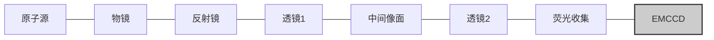

# 原子探测保真度标定的技术报告

## 一、 原子探测技术简介

在铷 87 中性原子阵列实验中，为了在阵列重排时判断偶极阱中是否有原子，也为了可以通过态选择吹飞原子后读出量子比特的状态，我们需要对单原子进行探测。目前的单原子探测有两种可行的技术路径，一是直接通过荧光成像来区分有无原子，二是通过光学腔耦合原子能级引起腔的共振频率改变进行光学手段的探测。综合考虑操作难度、探测保真度、系统复杂度和对大规模阵列的兼容性，荧光成像的方法整体更优，而光学腔耦合的方式探测耗时更短，可能在量子容错线路中有潜在优势。单原子的荧光成像依赖于高数值孔径（numerical aperture，NA）物镜，通过增大收集荧光的立体角使得荧光成像的信噪比和成像消耗的时间更容易达到平衡后的理想参数。

本技术报告将详细介绍我们的单原子探测的方案、物理参数、噪声分析和成像保真度的标定。

## 二、 原子探测技术方案

### 2.1 单原子荧光成像光路设计

单原子荧光成像光路示意图如下：

图 2.1 单原子荧光成像光路示意图

我们的单原子荧光成像光路如图 2.1 所示。单原子荧光的收集首先通过前文提到的高数值孔径（NA）的物镜完成。随后，荧光经过一枚有效焦距为 150 mm 的最佳外形球面透镜，该透镜与为有效焦距 4 mm 的高 NA 物镜构成了一个放大倍率为 37.5 倍一级成像系统。

我们用二向色镜（Di02-R785-25.4-D，Semrock）将 808 nm 的偶极光阱与原子荧光在高 NA 物镜前进行了分束，以便通过使用同一个高 NA 物镜来增强偶极阱光路和显微成像光路之间的相对稳定性。

我们在 150 mm 透镜的焦平面附近设置了一个快门。该快门可以在相机曝光前防止强光打入，避免由于曝光前的强光照射引发的鬼影效应，减少对图像的污染，从而有效提高信噪比，确保荧光信号的清晰度和准确性。经过快门后，荧光光束继续通过一对有效焦距分别为 100 mm 和 75 mm 的最佳外形球面透镜，形成对荧光的二级成像。一级与二级成像系统构成的总放大倍率为 28.125 倍。最后，荧光光束进入电子倍增 CCD 相机（EMCCD，iXon Ultra 888，Andor），该相机能够高效地捕捉到微弱的荧光信号并进行放大处理。

为了进一步提升信号质量，减少环境光的干扰，相机前安装了一个窄带滤光片。该滤光片的作用是过滤掉非目标波长的光，确保仅有原子荧光进入相机，从而最大限度地避免环境光对荧光成像的影响。

## 2.2 原子探测技术原理

$5P_{1/2}, F = 2$
795 nm probe
795 nm repumper
$5S_{1/2}, F = 2$
$5S_{1/2}, F = 1$

图 2.2 基于 D1 线（795 nm）非循环跃迁的原子荧光成像

常规的单原子荧光成像通常是通过 D2 线的循环跃迁来实现的。然而，由于 D2 线跃迁同时也被用于实现磁光阱（MOT），这导致成像过程中容易受到 MOT 高功率冷却光的散射光的影响，特别是在进入用于开关此激光的器件之前的光路中散射光的干扰，这会显著降低荧光成像的信噪比。因此，为了解决这一问题，我们采用了 D1 线构建的 $\Lambda$ 型灰色黏团（$\Lambda$GM）冷却技术，在实现冷却的同时，也能保证高保真度的单原子荧光成像效果。这种单原子荧光成像技术基于 D1 线（795 nm）非循环跃迁实现，其原理如图 2.2 所示。

与 D2 线不同，D1 线的跃迁不涉及 MOT 的冷却过程，因此能够有效避免 MOT 光路中的高功率 D2 线冷却光散射的干扰。在使用 D1 线进行荧光成像时，可以通过安装适当的滤光片，滤除光路中 D2 线的强光，从而显著降低由 MOT 冷却光散射所带来的背景噪声。这样的设计有助于提高信噪比，确保成像质量更为清晰。

此外，通过精确调节 $\Lambda$GM 冷却系统中的光强、单光子失谐和双光子失谐量，可以在冷却效果与荧光散射率之间找到最佳平衡。这种优化策略使得冷却效果得到提升的同时，也能最小化光散射对荧光信号的影响，从而达到最佳的单原子显微成像保真度。通过这种方法，我们不仅能高效地冷却原子，还能确保成像过程中的高分辨率和高精度，从而有效提升单原子成像的质量。

## 2.3 单原子荧光探测数据处理的方法

我们用 EMCCD 对原子荧光进行采集，并根据 Saffman 团队 Lichtman 的博士论文《Coherent operations, entanglement, and progress toward quantum search in a large 2D array of neutral atom qubits》提供的方法，对所采集的荧光数据进行处理，来判断偶极阱中是否成功装载单原子。首先，在相机上原子荧光成像区域划出方形的目标区域（region of interest, ROI）使其包裹住单原子发出荧光成像的范围。然后，通过统计概率性装载 0 个或 1 个原子的情况下 ROI 中原子荧光计数的分布直方图，得到两个可区分的高斯分布的叠加（双峰分布），平均值较小的高斯分布对应 0 个原子，即荧光成像的背景，而另一个高斯分布对应 1 个原子的成像结果。图 2.3 展示了 Lichtman 的博士论文中单原子荧光计数的双峰分布结果（原文图 7.35）。

需要指出的是，在概率论原理上统计原子荧光打到相机上的光子数本应该是服从泊松分布的，但是这里我们没用通过相机上读出的计数反推到光子数，且由于实际光子数较大

所以采用了高斯分布进行近似。我们将两个高斯分布的交点对应的荧光计数作为划分 0 和 1 个原子的阈值，小于此阈值判断为 0 个原子，大于则为 1 个原子。在该阈值下，原子探测结果出现误判的概率最低。根据该博士论文第 10.3 节所述，此时两个高斯分布的重叠率可以视为出现误判的概率 $\epsilon$，即原子探测保真度即为 $1 - \epsilon$。我们在实验研究中对比了通过该方法得到的探测保真度，与实际测量得到的保真度的差异，结果见研究进展 3.3 与 3.4。

The image shows a histogram of measurement counts versus region of interest photoelectrons, displaying a bimodal distribution. The left peak (blue) is centered at $269 \pm 19.3$ and the right peak (red) is centered at $463 \pm 29.2$. A vertical line at 346 separates the two distributions. Text in the plot indicates "loading: 67%" and "overlap: 0.0%". The y-axis is labeled "measurement count (out of 500)" with markings at 0, 33, and 44.

图 2.3 Saffman 团队的单原子荧光计数双峰分布结果

## 2.4 原子探测保真度标定的方法

具体而言，原子探测结果出现误判存在两种情况：一种为无原子事件被误判为有原子事件，即荧光计数本应判定为 dark（D），但被误判为 bright（B）；另一种为有原子事件被误判为无原子事件，即荧光计数本应判定为 B，但被误判为 D。

对于第一种情况，我们可以直接在不装载单原子的情况下，根据我们设定的 D 和 B 事件的计数阈值，对背景光计数进行统计处理。此时，每次探测事件的结果都应该为 D，而其中出现事件 B 的频率则为 D 误判为 B 的 infidelity。

对于第二种情况，我们可以利用无缺陷原子阵列重排技术、及多次原子探测，对 B 误判为 D 的 infidelity 进行统计。具体时序如下：单原子装载并 PGC 后，对原子阵列进行第 1 次探测，并根据探测结果对原子阵列实施无缺陷重排；重排后，对原子阵列进行第 2 次探测，以检查重排结果；而后对原子阵列再次 PGC，实施最外态制备，并进行第 3 次探测。我们对第 2、3 次探测的结果进行统计，在认为所有的态制备与探测（SPAM）错误都为小概率事件，且只考虑一阶误差的前提下（即不考虑两种及以上小概率事件同时发生的情况），4 种探测结果所代表的事件含义如下：

(i) DD 事件：由于原子阵列重排的不完美，导致目标区域处存在缺陷，因此第 2、3 次探测均没有原子。

(ii) DB 事件：目标区域有原子，但第 2 次探测出现误判。

(iii) BD 事件：目标区域在第 2 次探测期间有原子，但 PGC、态制备过程中出现真实的原子损失，或第 3 次探测出现误判。

(iv) BB 事件：目标区域有原子，且没有 SPAM 错误，为大概率事件。

因此，DB 事件出现的频率即为单次原子探测中 B 误判为 D 的 infidelity。

# 三、 原子探测技术研究进展

## 3.1 背景噪声分析

我们使用的相机型号为 iXon Ultra 888，厂商为英国的 Andor 公司，这是一款电子倍增 CCD 相机（EMCCD）。其电子倍增系数设置为 100，读出速度设置为最慢的挡位 1MHz，binning 设置为 4，使得 CCD 本身的读出噪声降至最低，此时的成像背景噪声几乎不受 CCD 本身的读出噪声影响，而是被时钟感生电荷（clock induced charge，CIC）限制，等效约为每个像素零点几个光电子。在使用 D2 线循环跃迁（780 nm）成像时，拍摄图像的背景噪声主要来自光学平台内的大量前级光路中的散射，尽管我们已经使用各种黑色板材见缝插针地遮挡，还是难以避免相机上被这些杂散光干扰，引入远高于 CIC 的噪声背景，可以达到每个像素几十个光电子的水平。此外，由于 780 滤光片的性能有限，还有一小部分背景来自偶极阱的强光散射，约每个像素几个光电子。为了压低背景噪声，我们决定弃用 D2 线循环跃迁成像，而是改为 D1 线（795 nm）成像，这使得背景噪声得到了数量级的压制。

## 3.2 成像参数优化

为了达到散射率和原子温度的平衡，以实现保证成像保真度的同时减少由于成像造成的原子损失的效果，我们对阱深和 $\Lambda$GM 的两种不同频率激光的失谐及光强进行了优化，最终选取参数为：阱深 1.3 mK，两束光相对自由空间 D1 线均蓝失谐 29 MHz（与偶极阱造成的光位移相当），且其频差相对于 $|5S_{1/2}, F=1\rangle \leftrightarrow |5S_{1/2}, F=2\rangle$ 的拉曼跃迁频率红失谐约 0.2 MHz（与偶极阱中声子能级间距相当）。

## 3.3 单原子荧光探测的数据处理

我们通过 2.3 所述的方法对原子探测保真度进行标定。为了更准确地拟合 0 个原子的计数所对应的高斯分布，我们通过在完成装载后关闭偶极阱再重新打开的方式造成一些原子损失，降低了原子的装载率，以免 0 个原子的出现频次太少导致拟合结果可靠性的降低。图 3.1 为我们在实验中得到的 site 2 的单原子荧光计数的双峰分布直方图。我们对双峰分布进行高斯拟合，并将两个高斯分布的交点对应的荧光计数作为划分无原子事件（D 事件）和单原子事件（B 事件）的阈值。对原子阵列每个 site 的荧光探测阈值，我们每日都会重新标定。通过计算，我们得到图 3.1 的双峰分布所对应的阈值计数为 5062.7，两个高斯分布的重叠区域为 0.00165。因此可以推测，原子探测保真度在 $1 - 0.00165 = 99.835\%$ 左右。

[The image shows a histogram of single-atom fluorescence counts for site 2. It features two distinct peaks: a blue peak on the left representing background (BG) and an orange peak on the right representing single atoms. Both peaks are fitted with Gaussian curves (black lines). The x-axis represents fluorescence counts ranging from 4500 to 7500, and the y-axis represents probability density from 0.0000 to 0.0010. A legend indicates: Blue = BG, Orange = Single Atoms, Black line = double_Gaussian_fitting.]

图 3.1 双峰分布直方图及高斯拟合（site 2）

## 3.4 原子探测保真度的标定

<table>
  <thead>
    <tr>
        <th></th>
        <th>Site Index</th>
        <th>PB</th>
        <th>Error Bar (approx.)</th>
    </tr>
  </thead>
  <tbody>
    <tr>
        <td>0</td>
        <td>0.0040</td>
        <td>0.0015</td>
        <td></td>
    </tr>
    <tr>
        <td>1</td>
        <td>0.0000</td>
        <td>0.0000</td>
        <td></td>
    </tr>
    <tr>
        <td>2</td>
        <td>0.0030</td>
        <td>0.0012</td>
        <td></td>
    </tr>
    <tr>
        <td>3</td>
        <td>0.0020</td>
        <td>0.0010</td>
        <td></td>
    </tr>
    <tr>
        <td>4</td>
        <td>0.0055</td>
        <td>0.0017</td>
        <td></td>
    </tr>
    <tr>
        <td>5</td>
        <td>0.0000</td>
        <td>0.0000</td>
        <td></td>
    </tr>
    <tr>
        <td>6</td>
        <td>0.0005</td>
        <td>0.0005</td>
        <td></td>
    </tr>
    <tr>
        <td>7</td>
        <td>0.0155</td>
        <td>0.0028</td>
        <td></td>
    </tr>
    <tr>
        <td>8</td>
        <td>0.0040</td>
        <td>0.0015</td>
        <td></td>
    </tr>
    <tr>
        <td>9</td>
        <td>0.0020</td>
        <td>0.0010</td>
        <td></td>
    </tr>
    <tr>
        <td>10</td>
        <td>0.0035</td>
        <td>0.0013</td>
        <td></td>
    </tr>
    <tr>
        <td>11</td>
        <td>0.0030</td>
        <td>0.0012</td>
        <td></td>
    </tr>
    <tr>
        <td>12</td>
        <td>0.0045</td>
        <td>0.0015</td>
        <td></td>
    </tr>
    <tr>
        <td>13</td>
        <td>0.0010</td>
        <td>0.0007</td>
        <td></td>
    </tr>
  </tbody>
</table>

图 3.2 原子阵列各 site 处 D 误判为 B 事件的频率统计

我们按照 2.4 所述的方法，对双比特门的保真度进行了标定。针对无原子情况下的探测保真度，我们通过关闭 2D MOT 的冷却（cooling）光、回泵（repumper）光、推移（pushing）光，来阻止单原子的装载，然后统计原子阵列各 site 处由背景计数贡献的 B 事件的频率，即单次原子探测 D 误判为 B 的 infidelity，结果如图 3.2 所示。对各 site 的统计结果进行平均，得到**无原子情况下的探测保真度为 99.65(4)%**。这个结果与 3.3 中通过计算双峰高斯分布重叠区域得到的保真度有较大出入。我们认为这是由于 3D MOT 仍然能从真空背景中俘获到稀薄原子团，并偶尔成功装载到偶极阱中导致的。

针对有原子情况下的探测保真度，我们依照 2.4 所述的时序，对无缺陷原子阵列重排后的两次原子探测结果进行了关联统计，得到原子阵列各 site 处 DB 事件出现的频率，即单次原子探测 B 误判为 D 的 infidelity，结果如图 3.3 所示。对各 site 的统计结果进行平均，得到**有原子情况下的探测保真度为 99.88(1)%**。这个结果与 3.3 中通过计算双峰高斯分布重叠区域得到的 site 2 的探测保真度接近。其差异我们认为由各个 site 的原子探测保真度不同且双峰分布直方图、DB 符合事件的数据量均不够所导致。

<table>
  <thead>
    <tr>
        <th>P_DB</th>
        <th>Site Index</th>
    </tr>
  </thead>
  <tbody>
    <tr>
        <td>0.0004</td>
        <td>0</td>
    </tr>
    <tr>
        <td>0.0010</td>
        <td>1</td>
    </tr>
    <tr>
        <td>0.0002</td>
        <td>2</td>
    </tr>
    <tr>
        <td>0.0004</td>
        <td>3</td>
    </tr>
    <tr>
        <td>0.0002</td>
        <td>4</td>
    </tr>
    <tr>
        <td>0.0008</td>
        <td>5</td>
    </tr>
    <tr>
        <td>0.0010</td>
        <td>6</td>
    </tr>
    <tr>
        <td>0.0036</td>
        <td>7</td>
    </tr>
    <tr>
        <td>0.0002</td>
        <td>8</td>
    </tr>
    <tr>
        <td>0.0038</td>
        <td>9</td>
    </tr>
    <tr>
        <td>0.0010</td>
        <td>10</td>
    </tr>
    <tr>
        <td>0.0002</td>
        <td>11</td>
    </tr>
    <tr>
        <td>0.0016</td>
        <td>12</td>
    </tr>
    <tr>
        <td>0.0020</td>
        <td>13</td>
    </tr>
  </tbody>
</table>

图 3.3 原子阵列各 site 处无缺陷重排后两次探测中 DB 事件的频率统计

我们整理了原子阵列每个 site 处，原子探测 D 误判为 B 与 B 误判为 D 事件发生的概率，结果汇总于下表 3.1。

表 3.1 原子阵列各 site 处原子探测误判概率汇总表

<table>
  <thead>
    <tr>
        <th>原子 site 索引</th>
        <th>D 误判为 B 概率</th>
        <th>B 误判为 D 概率</th>
    </tr>
  </thead>
  <tbody>
    <tr>
        <td>0</td>
        <td>0.0040(14)</td>
        <td>0.0004(3)</td>
    </tr>
    <tr>
        <td>1</td>
        <td>0.0000(0)</td>
        <td>0.0010(4)</td>
    </tr>
    <tr>
        <td>2</td>
        <td>0.0030(12)</td>
        <td>0.0002(2)</td>
    </tr>
    <tr>
        <td>3</td>
        <td>0.0020(10)</td>
        <td>0.0004(3)</td>
    </tr>
    <tr>
        <td>4</td>
        <td>0.0055(17)</td>
        <td>0.0002(2)</td>
    </tr>
    <tr>
        <td>5</td>
        <td>0.0000(0)</td>
        <td>0.0008(4)</td>
    </tr>
    <tr>
        <td>6</td>
        <td>0.0005(5)</td>
        <td>0.0010(4)</td>
    </tr>
    <tr>
        <td>7</td>
        <td>0.0155(28)</td>
        <td>0.0036(8)</td>
    </tr>
    <tr>
        <td>8</td>
        <td>0.0040(14)</td>
        <td>0.0002(2)</td>
    </tr>
    <tr>
        <td>9</td>
        <td>0.0020(10)</td>
        <td>0.0038(9)</td>
    </tr>
    <tr>
        <td>10</td>
        <td>0.0035(13)</td>
        <td>0.0010(4)</td>
    </tr>
    <tr>
        <td>11</td>
        <td>0.0030(12)</td>
        <td>0.0002(2)</td>
    </tr>
    <tr>
        <td>12</td>
        <td>0.0045(15)</td>
        <td>0.0016(6)</td>
    </tr>
    <tr>
        <td>13</td>
        <td>0.0010(7)</td>
        <td>0.0020(6)</td>
    </tr>
  </tbody>
</table>

平均来说，无原子、有情况下的探测保真度分别为 99.65(4)%、99.88(1)%，均满足

“探测保真度>99%”的阶段二合同指标。