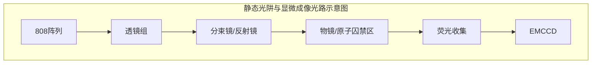

# 单原子囚禁与显微技术报告

## 一、 单原子囚禁与显微成像技术简介

在中性原子量子计算系统中，为了得到可单独操控的量子比特，我们需要实现单原子的囚禁与显微成像。单原子的囚禁与显微成像都依赖高数值孔径（numerical aperture，NA）物镜，一方面通过减小偶极阱的束腰使得光辅助碰撞发生的频率提高，另一方面通过增大收集荧光的立体角使得显微成像的信噪比和成像消耗的时间更容易达到平衡后的理想参数。此外，对于光辅助碰撞和单原子成像时所需要的近共振光的参数也需要进行细致的优化，以实现提高单原子囚禁装载率的效果。

本技术报告将详细介绍我们的单原子囚禁与显微成像光路设计，单原子俘获、冷却、成像的方法，及相关的参数优化。

## 二、 单原子囚禁与显微技术方案

### 2.1 单原子囚禁光路设计

注：上图为根据原图 2.1 简化的光路示意图。原图中包含激光输入、透镜、反射镜、808阵列输入以及荧光收集至 EMCCD 的完整路径。

图 2.1 静态光阱与显微成像光路示意图

如图 2.1 所示，用于单原子囚禁的静态光阱光路的设计从高功率保偏光纤开始，该光纤能够承受高功率激光输出，目前光阱的最高输出功率约为 1 W，输出激光的波长为 808 nm，发散角为 0.09 rad。在光束出射之后，首先通过一枚有效焦距为 31.25 mm 的非球面透

镜进行准直处理，准直后的高斯光束束腰半径为 2.9 mm 左右。这束准直光经过波片和偏振分光棱镜（polarization beam splitter，PBS）后可以得到消光比较高的线偏振激光。

接着，准直光束经过空间光调制器（spatial light modulator，SLM），被调制成多束沿不同方向传播的准直光，为后续形成静态光阱阵列创造了条件。SLM（HED 6010-NIR-080-C, Holoeye）的液晶屏幕尺寸为 15.36×8.64 mm，其分辨率为 1920×1080，像元尺寸为 8 $\mu$m。之所以要选择焦距为 31.25 mm 的非球面透镜对出射光准直，而不是选用更常用的短焦透镜，目的是为了让准直后的光束更粗，入射 SLM 液晶屏幕后能覆盖更多的像素区域。我们在 SLM 前放置了 808 nm 的窄带滤波片（LL01-808-25，Semrock），滤除由激光器的自发辐射和光纤的非线性效应所引入的与 D 线共振的频率成分。由于被放置在反射式 SLM 前，窄带滤波片会对 808 光束产生两次滤波作用，进一步增强其滤除噪声频率成分的能力。

经过空间光调制器后的多束准直光再通过一枚焦距为 200 mm 的最佳外形球面透镜聚焦在该透镜的焦平面上，形成空间上分布的多个光点。我们在这里插入了两个波片，可以用于偶极阱偏振的调节。为避免零级光的干扰，我们在焦平面上用一块刀片遮挡掉未经调制的零级光，从而确保进入后续光路的光束均为经过调制的目标光束，避免零级光影响光阱阵列的正常装载。此后，剩余光束进入一个 4f 系统，该系统由焦距为 100 mm 的最佳外形球面透镜和有效焦距为 4 mm 的显微镜物镜（G Plan Apo 50x，Mitutoyo）构成，其中显微镜物镜对 808 nm 光束的 NA=0.5，透射率约为 50%。通过这个 4f 缩放系统，光束进一步聚焦并缩放，最终在真空玻璃腔内形成多个偶极阱阵列。

我们采用 GaussianBeam 软件对高斯光束的传输过程进行了模拟，如图 2.2 所示，从图中模拟的结果可以看到，这些偶极阱的束腰半径约为 1.4 $\mu$m。我们通过调节加载在 SLM 上的相图，使阵列的中心位置与磁光阱（MOT）所捕获的原子团中心相近，当阱深足够时，偶极阱阵列可以直接从 MOT 原子团中俘获原子，实现有效的原子捕获。由于光路中涉及的多种光学元件会带来不同程度的功率损耗，在 SLM 前功率约为 0.5 W 的激光，最终在真空腔内形成了阱深约为 1.3 mK 的偶极阱阵列，从而为后续的实验提供稳定的冷原子捕获环境。

GaussianBeam
Open Save Save as Add optics Remove Wavelength 800 nm

<table>
  <thead>
    <tr>
        <th>Optics</th>
        <th>Position (mm)</th>
        <th>Relative position (mm)</th>
        <th>Properties</th>
        <th>Waist (μm)</th>
        <th>Waist position (mm)</th>
        <th>Rayleigh range (mm)</th>
        <th>Divergence (mrad)</th>
        <th>Sensitivity (%/mm²)</th>
        <th>Name</th>
        <th>Lock</th>
    </tr>
  </thead>
  <tbody>
    <tr>
        <td>Input beam</td>
        <td>10</td>
        <td>-</td>
        <td>n = 1, M² = 1</td>
        <td>2.75123</td>
        <td>10</td>
        <td>0.0294302</td>
        <td>93.2124</td>
        <td>28855.5</td>
        <td>w0</td>
        <td>absolute</td>
    </tr>
    <tr>
        <td>Lens</td>
        <td>41.25</td>
        <td>31.25</td>
        <td>f = 31.25 mm</td>
        <td>2921.35</td>
        <td>72.5</td>
        <td>33182.3</td>
        <td>0.0880395</td>
        <td>28855.5</td>
        <td>L1</td>
        <td>none</td>
    </tr>
    <tr>
        <td>Lens</td>
        <td>272.5</td>
        <td>231.25</td>
        <td>f = 200 mm</td>
        <td>17.6079</td>
        <td>472.5</td>
        <td>1.20546</td>
        <td>14.6057</td>
        <td>17.2054</td>
        <td>L3</td>
        <td>none</td>
    </tr>
    <tr>
        <td>Lens</td>
        <td>572.5</td>
        <td>300</td>
        <td>f = 100 mm</td>
        <td>1460.68</td>
        <td>672.5</td>
        <td>8295.58</td>
        <td>0.176079</td>
        <td>17.2092</td>
        <td>L5</td>
        <td>none</td>
    </tr>
    <tr>
        <td>Lens</td>
        <td>676.5</td>
        <td>104</td>
        <td>f = 4 mm</td>
        <td>0.704316</td>
        <td>680.5</td>
        <td>0.00192874</td>
        <td>350.124</td>
        <td>6.29718e...</td>
        <td>L4</td>
        <td>none</td>
    </tr>
  </tbody>
</table>
<table>
  <thead>
    <tr>
        <th>Optics bench</th>
        <th>Boundaries</th>
    </tr>
  </thead>
  <tbody>
    <tr>
        <td>Left</td>
        <td>-100.00 mm</td>
    </tr>
    <tr>
        <td>Right</td>
        <td>1700.00 mm</td>
    </tr>
  </tbody>
</table>

The image shows a simulation of a Gaussian beam propagating through a series of lenses. The beam profile is shown in red, narrowing and widening as it passes through the optical elements.

<table>
  <thead>
    <tr>
        <th>View properties</th>
        <th></th>
    </tr>
  </thead>
  <tbody>
    <tr>
        <td>Width</td>
        <td>1600.00 mm</td>
    </tr>
    <tr>
        <td>Height</td>
        <td>10000.00 μm</td>
    </tr>
    <tr>
        <td>Origin</td>
        <td>-99.88 mm</td>
    </tr>
  </tbody>
</table>

Magic waist [ ]
Waist fit [ ]
Position: 407.07 mm Beam radius: 955.92 μm Beam curvature: -65.46 mm

图 2.2 高斯光束传输过程的模拟

## 2.2 单原子显微成像光路设计

如图 2.1 所示，单原子荧光的收集首先通过前文提到的高数值孔径（NA）的物镜完成。随后，荧光经过一枚有效焦距为 150 mm 的最佳外形球面透镜，该透镜与为有效焦距 4 mm 的高 NA 物镜构成了一个放大倍率为 37.5 倍一级成像系统。我们用二向色镜（Di02-R785-25.4-D，Semrock）将 808 nm 的偶极光阱与原子荧光在高 NA 物镜前进行了分束，以便通过使用同一个高 NA 物镜来增强偶极阱光路和显微成像光路之间的相对稳定性。

我们在 150 mm 透镜的焦平面附近设置了一个快门。该快门可以在相机曝光前防止强光打入，避免由于曝光前的强光照射引发的鬼影效应，减少对图像的污染，从而有效提高信噪比，确保荧光信号的清晰度和准确性。经过快门后，荧光光束继续通过一对有效焦距分别为 100 mm 和 75 mm 的最佳外形球面透镜，形成对荧光的二级成像。最后，荧光光束进入电子倍增 CCD 相机（EMCCD，iXon Ultra 888，Andor），该相机能够高效地捕捉到微弱的荧光信号并进行放大处理。

为了进一步提升信号质量，减少环境光的干扰，相机前安装了一个窄带滤光片。该滤光片的作用是过滤掉非目标波长的光，确保仅有原子荧光进入相机，从而最大限度地避免环境光对荧光成像的影响。

## 2.3 光辅助碰撞方案

在偶极阱中，原子可通过概率性装载实现一个或多个原子的捕获。为了确保每个偶极阱中的原子数不超过一个，需要引入光辅助碰撞机制，通过多体损失排除多余的原子。光

辅助碰撞的原理是通过接近共振的激光构建原子间的分子势，其中红失谐激光产生吸引势，蓝失谐激光产生排斥势。具体来说，红失谐激光的吸引势使得两原子相互接近并积累动能，碰撞后极有可能使它们共同脱离偶极阱的束缚。蓝失谐激光的排斥势则能更灵活地控制碰撞释放的动能，通过精确调节失谐参数，可实现每次碰撞仅损失一个原子，从而有效提高单原子保留的概率。

在实际操作中，红失谐激光虽然能够实现单原子囚禁，但其成功率通常仅为 50%左右，且难以进一步提升。而蓝失谐激光由于具有排斥特性，通过合理调节其参数，单原子囚禁的成功率可提高至 80%以上。然而，蓝失谐激光在没有额外冷却机制的情况下，会受到多普勒效应的影响，导致原子动能快速增加，从而迅速脱离偶极阱的束缚。因此，在使用蓝失谐激光时，必须结合如灰色黏团（grey molasses，GM）等冷却技术，以有效抵消多普勒加热，从而进一步提高单原子的装载率。

在灰色黏团冷却方案中，通过构建 $\Lambda$ 型拉曼冷却过程可以显著增强冷却效果。在此过程中，使用 $|5S_{1/2}, F=1\rangle \leftrightarrow |5P_{1/2}, F=2\rangle$ 和 $|5S_{1/2}, F=2\rangle \leftrightarrow |5P_{1/2}, F=2\rangle$ 两种频率成分激光形成 $|5S_{1/2}, F=1\rangle \leftrightarrow |5S_{1/2}, F=2\rangle$ 的拉曼冷却通道。将这一过程引入灰色黏团的冷却方案，即称为 $\Lambda$ 增强型灰色黏团冷却（$\Lambda$-enhanced grey molasses，$\Lambda$GM）。该冷却方法通过 $\Lambda$ 型配置进一步优化了灰色黏团的冷却效率，有助于提高单原子的装载概率，并显著降低原子的动能，确保其在偶极阱中稳定地保持在捕获状态。

## 2.4 波前畸变修正方案

随着光阱阵列规模的不断扩大，波前畸变对光束质量的影响变得愈加显著。这种波前畸变通常源于光学元件表面或镀膜的光学均匀性不足。此外，SLM 屏幕的表面不平整也会引入额外的波前畸变。波前畸变的存在对光阱性能产生多方面的负面影响。首先，它会降低光斑束腰处的峰值功率，从而减小原子感受到的光频移，限制光阱阵列的整体规模。其次，波前畸变会改变光斑的尺寸和形状，直接影响光阱之间的最小间距，进而限制光阱的

紧凑排列。此外，全息图的计算通常基于平整波前的高斯光束模型，而波前畸变的存在会降低全息图的生成质量，进一步影响光阱的阵列性能。因此，为了确保光阱阵列的性能和规模，对波前畸变进行有效修正是十分必要的。这不仅有助于优化光束质量和提高光阱阵列的均匀性，还为后续的实验提供了更高的稳定性和可控性。

光学系统中的波前畸变可以由 Zernike 多项式来描述。Zernike 多项式是一组定义在单位圆上的正交多项式，它们对应不同的物理波前特性，例如：

(i) 低阶项（如倾斜、离焦等）描述基础的几何畸变。

(ii) 高阶项（如彗差、球差、像散等）描述更复杂的波前畸变。

由于 Zernike 多项式的正交性，任何波前畸变都可以分解为这组多项式的线性组合，因此可以通过调整每个项的权重系数来准确补偿特定类型的畸变。SLM 通过调制入射光的相位来改变波前形状。在 SLM 上加载的相位分布可以由 Zernike 多项式计算生成，作用是引入一个特定的相位补偿，与波前畸变的相位变化相反，从而使经过修正后的波前趋于平坦。因此，我们通过在 SLM 上面加载一系列不同阶项的 Zernike 多项式，并且根据效果对每一项的权重系数进行调整，就能够很好的补偿光学系统中的波前畸变。

The image shows a plot of Loading Rate versus init_trap_depth (uK). The data points follow an arctangent-like curve, starting near 0 at 200 uK and saturating around 0.55-0.60 for trap depths above 600 uK. A fitting table is included within the plot area.

<table>
  <tbody>
    <tr>
        <td>Model</td>
        <td>Arctan_fitting (User)</td>
    </tr>
    <tr>
        <td>Equation</td>
        <td>A*atan((x-x0)/w)/(PI/4)+B</td>
    </tr>
    <tr>
        <td>Plot</td>
        <td>Loading Rate</td>
    </tr>
    <tr>
        <td>A</td>
        <td>0.17246 ± 0.00559</td>
    </tr>
    <tr>
        <td>B</td>
        <td>0.25755 ± 0.00686</td>
    </tr>
    <tr>
        <td>x0</td>
        <td>333.1955 ± 3.57823</td>
    </tr>
    <tr>
        <td>w</td>
        <td>62.05426 ± 4.97353</td>
    </tr>
    <tr>
        <td>Reduced Chi-Sqr</td>
        <td>1.45463E-4</td>
    </tr>
    <tr>
        <td>R-Square (COD)</td>
        <td>0.99694</td>
    </tr>
    <tr>
        <td>Adj. R-Square</td>
        <td>0.9964</td>
    </tr>
  </tbody>
</table>

图 2.3 原子阵列装载率随阱深的变化关系。

初步的波前畸变修正可以通过 sCMOS 相机成像来完成。我们在 SLM 的对侧通过 sCMOS 相机对光阱阵列进行成像，并优化 Zernike 多项式使 sCMOS 相机上的光斑的峰值计数最高。然而，通过光斑成像的方式无法保证原子处的波前畸变得到了完美的补偿，因为后续的成像光路依然可能会引入额外的波前畸变，这部分波前畸变最终也会反映到 sCMOS 的计数上，从而影响原子处的波前修正效果。因此，在进行了初步的波前修正后，我们改用原子装载率对原子处波前畸变进行更精细的补偿。在不进行 $\Lambda$ 增强型灰色黏团冷却的情况下，原子阵列的装载率在一定范围内随阱深的增大而增大，如图 2.3 所示。因此，我们

将初始阱深放在图中斜率最大的位置，对应初始阱深 $\sim 320\ \mu K$，此时装载率对阱深的变化最敏感，然后通过扫描 Zernike 多项式的权重系数，使装载率达到最高，如果优化的过程中装载率已经达到峰值 $\sim 0.5$，还需要重新扫描装载率随阱深的变化关系，并且选取新的初始阱深。通过这种方式，我们可以使原子处的波前得到完美的修正。

## 2.5 阱深均匀度优化方案

在综合考虑 SLM 表面的平整度和光学元件引入的波前畸变后，采用 GS 算法迭代生成的光阱阵列，其阱深分布仍然表现出较大的不均匀性。这种不均匀性可能源于两方面：一是光在 SLM 屏幕上的衍射效率分布不均匀，二是 GS 算法本身的局限性。针对前者，可以引入基于反馈回路的优化方法，通过对目标光强分布进行迭代修正来补偿衍射效率的不均匀性；针对后者，则可以尝试使用改进算法，例如 WGS 算法，以提高光阱阵列的均匀性。

光阱阵列的均匀性对后续实验的影响至关重要。对于阱深较大的光阱，原子会感受到较大的光频移，这会直接影响后续冷却过程的效率，使冷却效果下降，并在探测过程中显著减少原子释放的光子数。相反，阱深较小的光阱对原子的束缚能力不足，可能导致部分原子在实验结束时未能重新被捕获，造成原子的损失。这些问题不仅影响实验的可重复性，还可能降低整体的实验效率。因此，优化光阱阵列的均匀性对于确保实验的稳定性和精确性

至关重要。通过结合反馈控制和算法改进，可以有效提升光阱阵列的性能，为后续的精密实验提供更可靠的实验环境和更高的实验效率。

与波前修正的方案类似，初步的阱深均匀度优化同样可以通过 sCMOS 相机成像来完成，并且会受限于成像光路。具体的，由于成像光路对于不同角度光束的透射率以及引入的畸变均不同，相机上光斑计数的均匀并不能反映原子处阱深的均匀。因此，我们同样考虑通过原子装载率对阱深均匀度进行进一步优化。我们将阱深放在装载率最敏感的位置，获取每个阱的装载率信息，并通过装载率和阱深的变化关系反推每个阱的阱深信息，用来反馈阱的均匀度。

# 三、 单原子囚禁技术研究进展

## 3.1 原子俘获参数优化

在 MOT 中直接俘获的原子初始温度较高，约为 150 μK，不利于可控的蓝失谐光辅助碰撞过程的实现。因此我们在 MOT 阶段结束后，通过偏振梯度冷却（Polarization Gradient Cooling，PGC），将原子团的温度冷却到 40 μK 左右，以便在更低温度下进行装载。PGC 的失谐量设置为红失谐 15 倍自然线宽。我们在 PGC 阶段关闭梯度磁场，并以 10 mG 的精度优化偏置磁场，使得温度尽可能降低。温度测量采用飞行时间法（time of flight，ToF），通过对不同时间的原子团半高宽进行高斯拟合，得到原子团温度约为 40 μK。在此温度下，将原子团中心与偶极阱阵列区域大致对齐，优化阱深，结果显示在 0.3~1.0 mK 范围内装载效果无显著差异。

## 3.2 光辅助碰撞参数优化

在偶极阱中概率性装载一个或多个原子之后，我们利用 $\Lambda$GM 进行蓝失谐光辅助碰撞以提高单原子留存概率，然后再进行 PGC 实现红失谐光辅助碰撞确保不会出现单个偶极阱中留存多原子的情形。优化阱深和 $\Lambda$GM 的两种不同频率激光的失谐及光强，最终选取参

数为阱深 1.3 mK，两束光相对自由空间 D1 线均蓝失谐 29 MHz（与偶极阱造成的光位移相当），且其频差相对于 $|5 S_{1/2}, F=1\rangle \leftrightarrow |5 S_{1/2}, F=2\rangle$ 的拉曼跃迁频率红失谐约 0.2 MHz（与偶极阱中声子能级间距相当）。在这组参数下可以实现约 80% 的单原子装载概率，相较于传统 PGC 辅助碰撞的方式（装载率约 50%），这极大地减小了实现无缺陷阵列的难度。图 3.1 所示为一次典型的装载结果，在 72 个偶极阱中，单次拍照得到的图像中有 58 个偶极阱成功装载了原子且被探测到。

The image shows a fluorescence microscopy image of a single-atom array. There are two horizontal rows of optical dipole traps, each highlighted with red squares. Bright white spots within the squares indicate the presence of a single atom. In this specific capture, 58 out of 72 traps are occupied by atoms.

图 3.1 单次拍照的单原子装载结果

## 3.3 基于原子装载率的波前畸变优化

我们按照 2.4 节中所述的方式对原子处的波前进行精确修正。初始阱深设置为 $320 \ \mu K$，然后逐项精确扫描 Zernike 多项式的权重系数，以优化装载率达到最高，扫描的结果如表 3.1 所示。扫描过程中装载率达到峰值，因此我们将阱深修改为 $260 \ \mu K$，以进行后续的优化。

经过波前修正后，光阱的形状更加接近理想的高斯分布，其束腰半径相比修正前有所减小从而导致了阱深的增大。然而，阱深的增大导致其与探测参数之间的不匹配，反而影响探测效果，所以需要降低阱深来匹配探测参数。经过优化后，每个阱需要的功率减少了约 1/3，这意味着在相同光阱功率下，采用优化后的波前能额外产生 50% 的阱，这显著提高了光阱阵列的规模。

表 3.1 Zernike 多项式优化过程

<table>
  <thead>
    <tr>
        <th>Zernike 多项式</th>
        <th>修正情况</th>
    </tr>
  </thead>
  <tbody>
    <tr>
        <td></td>
        <td></td>
    </tr>
  </tbody>
</table>

<table>
  <tbody>
    <tr>
        <td colspan="2">Astig0/Astig45</td>
        <td rowspan="2">Loading Rate vs Astig0</td>
        <td rowspan="2">Loading Rate vs Astig45</td>
    </tr>
    <tr>
        <th>模型</th>
        <th>GaussAmp</th>
        <th>模型</th>
        <th>GaussAmp</th>
    </tr>
    <tr>
        <th>方程</th>
        <th>y=y0+A*exp(-0.5*((x-xc)/w)^2)</th>
        <th>方程</th>
        <th>y=y0+A*exp(-0.5*((x-xc)/w)^2)</th>
    </tr>
    <tr>
        <th>绘图</th>
        <th>Loading Rate</th>
        <th>绘图</th>
        <th>Loading Rate</th>
    </tr>
    <tr>
        <td>y0</td>
        <td>0.00122 ± 0.0017</td>
        <td>y0</td>
        <td>-4.55884E-4 ± 0.0032</td>
    </tr>
    <tr>
        <td>xc</td>
        <td>0.27456 ± 0.00176</td>
        <td>xc</td>
        <td>0.03236 ± 0.00325</td>
    </tr>
    <tr>
        <td>w</td>
        <td>0.12478 ± 0.00189</td>
        <td>w</td>
        <td>0.16369 ± 0.00362</td>
    </tr>
    <tr>
        <td>A</td>
        <td>0.43258 ± 0.00543</td>
        <td>A</td>
        <td>0.46868 ± 0.00838</td>
    </tr>
    <tr>
        <td>Reduced Chi-Sqr</td>
        <td>4.13393E-5</td>
        <td>Reduced Chi-Sqr</td>
        <td>1.25828E-4</td>
    </tr>
    <tr>
        <td>R平方(COD)</td>
        <td>0.99785</td>
        <td>R平方(COD)</td>
        <td>0.99538</td>
    </tr>
    <tr>
        <td>调整后R平方</td>
        <td>0.99747</td>
        <td>调整后R平方</td>
        <td>0.99457</td>
    </tr>
  </tbody>
</table>
<table>
  <tbody>
    <tr>
        <td colspan="2">TrifoilX/TrifoilY</td>
        <td rowspan="2">Loading Rate vs TrifoilX</td>
        <td rowspan="2">Loading Rate vs TrifoilY</td>
    </tr>
    <tr>
        <th>模型</th>
        <th>GaussAmp</th>
        <th>模型</th>
        <th>GaussAmp</th>
    </tr>
    <tr>
        <th>方程</th>
        <th>y=y0+A*exp(-0.5*((x-xc)/w)^2)</th>
        <th>方程</th>
        <th>y=y0+A*exp(-0.5*((x-xc)/w)^2)</th>
    </tr>
    <tr>
        <th>绘图</th>
        <th>Loading Rate</th>
        <th>绘图</th>
        <th>Loading Rate</th>
    </tr>
    <tr>
        <td>y0</td>
        <td>-0.00839 ± 0.01683</td>
        <td>y0</td>
        <td>-0.00243 ± 0.01446</td>
    </tr>
    <tr>
        <td>xc</td>
        <td>-0.00296 ± 0.00666</td>
        <td>xc</td>
        <td>-0.00987 ± 0.00536</td>
    </tr>
    <tr>
        <td>w</td>
        <td>0.18314 ± 0.01042</td>
        <td>w</td>
        <td>0.17973 ± 0.0088</td>
    </tr>
    <tr>
        <td>A</td>
        <td>0.5013 ± 0.02029</td>
        <td>A</td>
        <td>0.50543 ± 0.01683</td>
    </tr>
    <tr>
        <td>Reduced Chi-Sqr</td>
        <td>5.36923E-4</td>
        <td>Reduced Chi-Sqr</td>
        <td>3.62379E-4</td>
    </tr>
    <tr>
        <td>R平方(COD)</td>
        <td>0.98907</td>
        <td>R平方(COD)</td>
        <td>0.99269</td>
    </tr>
    <tr>
        <td>调整后R平方</td>
        <td>0.98439</td>
        <td>调整后R平方</td>
        <td>0.98965</td>
    </tr>
  </tbody>
</table>
<table>
  <tbody>
    <tr>
        <td colspan="2">ComaX/ComaY</td>
        <td rowspan="2">Loading Rate vs ComaX</td>
        <td rowspan="2">Loading Rate vs Astig2nd0</td>
    </tr>
    <tr>
        <th>模型</th>
        <th>GaussAmp</th>
        <th>模型</th>
        <th>GaussAmp</th>
    </tr>
    <tr>
        <th>方程</th>
        <th>y=y0+A*exp(-0.5*((x-xc)/w)^2)</th>
        <th>方程</th>
        <th>y=y0+A*exp(-0.5*((x-xc)/w)^2)</th>
    </tr>
    <tr>
        <th>绘图</th>
        <th>Loading Rate</th>
        <th>绘图</th>
        <th>Loading Rate</th>
    </tr>
    <tr>
        <td>y0</td>
        <td>8.84751E-4 ± 9.04956E-4</td>
        <td>y0</td>
        <td>8.84751E-4 ± 9.04956E-4</td>
    </tr>
    <tr>
        <td>xc</td>
        <td>-0.00642 ± 7.71081E-4</td>
        <td>xc</td>
        <td>-0.00642 ± 7.71081E-4</td>
    </tr>
    <tr>
        <td>w</td>
        <td>0.06914 ± 6.42866E-4</td>
        <td>w</td>
        <td>0.06914 ± 6.42866E-4</td>
    </tr>
    <tr>
        <td>A</td>
        <td>0.30663 ± 0.00262</td>
        <td>A</td>
        <td>0.30663 ± 0.00262</td>
    </tr>
    <tr>
        <td>Reduced Chi-Sqr</td>
        <td>6.10284E-6</td>
        <td>Reduced Chi-Sqr</td>
        <td>6.10284E-6</td>
    </tr>
    <tr>
        <td>R平方(COD)</td>
        <td>0.99953</td>
        <td>R平方(COD)</td>
        <td>0.99953</td>
    </tr>
    <tr>
        <td>调整后R平方</td>
        <td>0.99933</td>
        <td>调整后R平方</td>
        <td>0.99933</td>
    </tr>
  </tbody>
</table>

装载率达到峰值，初始阱深修改为

260 $\mu K$

<table>
  <tbody>
    <tr>
        <td colspan="2">Astig2nd0/Astig2nd45</td>
        <td rowspan="2">Loading Rate vs Astig2nd0</td>
        <td rowspan="2">Loading Rate vs Astig2nd45</td>
    </tr>
    <tr>
        <th>模型</th>
        <th>GaussAmp</th>
        <th>模型</th>
        <th>GaussAmp</th>
    </tr>
    <tr>
        <th>方程</th>
        <th>y=y0+A*exp(-0.5*((x-xc)/w)^2)</th>
        <th>方程</th>
        <th>y=y0+A*exp(-0.5*((x-xc)/w)^2)</th>
    </tr>
    <tr>
        <th>绘图</th>
        <th>Loading Rate</th>
        <th>绘图</th>
        <th>Loading Rate</th>
    </tr>
    <tr>
        <td>y0</td>
        <td>8.84751E-4 ± 9.04956E-4</td>
        <td>y0</td>
        <td>0.00165 ± 0.00438</td>
    </tr>
    <tr>
        <td>xc</td>
        <td>-0.00642 ± 7.71081E-4</td>
        <td>xc</td>
        <td>0.04771 ± 0.00224</td>
    </tr>
    <tr>
        <td>w</td>
        <td>0.06914 ± 6.42866E-4</td>
        <td>w</td>
        <td>0.0647 ± 0.00455</td>
    </tr>
    <tr>
        <td>A</td>
        <td>0.30663 ± 0.00262</td>
        <td>A</td>
        <td>0.39774 ± 0.01938</td>
    </tr>
    <tr>
        <td>Reduced Chi-Sqr</td>
        <td>6.10284E-6</td>
        <td>Reduced Chi-Sqr</td>
        <td>1.32874E-4</td>
    </tr>
    <tr>
        <td>R平方(COD)</td>
        <td>0.99953</td>
        <td>R平方(COD)</td>
        <td>0.9933</td>
    </tr>
    <tr>
        <td>调整后R平方</td>
        <td>0.99933</td>
        <td>调整后R平方</td>
        <td>0.99043</td>
    </tr>
  </tbody>
</table>

<table>
  <tbody>
    <tr>
        <td rowspan="2">QuadrafoilX/   QuadrafoilY</td>
        <td colspan="2">Loading Rate vs QuadrafoilX</td>
        <td colspan="2">Loading Rate vs QuadrafoilY</td>
    </tr>
    <tr>
        <th>Loading Rate</th>
        <th>QuadrafoilX</th>
        <th>Loading Rate</th>
        <th>QuadrafoilY</th>
    </tr>
    <tr>
        <td></td>
        <td>0.0</td>
        <td>-0.6</td>
        <td>0.0</td>
        <td>-0.6</td>
    </tr>
    <tr>
        <td></td>
        <td>0.0</td>
        <td>-0.5</td>
        <td>0.0</td>
        <td>-0.5</td>
    </tr>
    <tr>
        <td></td>
        <td>0.0</td>
        <td>-0.4</td>
        <td>0.0</td>
        <td>-0.4</td>
    </tr>
    <tr>
        <td></td>
        <td>0.05</td>
        <td>-0.3</td>
        <td>0.1</td>
        <td>-0.3</td>
    </tr>
    <tr>
        <td></td>
        <td>0.15</td>
        <td>-0.2</td>
        <td>0.2</td>
        <td>-0.2</td>
    </tr>
    <tr>
        <td></td>
        <td>0.3</td>
        <td>-0.1</td>
        <td>0.35</td>
        <td>-0.1</td>
    </tr>
    <tr>
        <td></td>
        <td>0.4</td>
        <td>0.0</td>
        <td>0.38</td>
        <td>0.0</td>
    </tr>
    <tr>
        <td></td>
        <td>0.3</td>
        <td>0.1</td>
        <td>0.3</td>
        <td>0.1</td>
    </tr>
    <tr>
        <td></td>
        <td>0.15</td>
        <td>0.2</td>
        <td>0.15</td>
        <td>0.2</td>
    </tr>
    <tr>
        <td></td>
        <td>0.05</td>
        <td>0.3</td>
        <td>0.05</td>
        <td>0.3</td>
    </tr>
    <tr>
        <td></td>
        <td>0.0</td>
        <td>0.4</td>
        <td>0.0</td>
        <td>0.4</td>
    </tr>
    <tr>
        <td></td>
        <td>0.0</td>
        <td>0.5</td>
        <td>0.0</td>
        <td>0.5</td>
    </tr>
    <tr>
        <td></td>
        <td>0.0</td>
        <td>0.6</td>
        <td>0.0</td>
        <td>0.6</td>
    </tr>
    <tr>
        <td rowspan="2">SphericalABB</td>
        <td colspan="2">Loading Rate vs SphericalABB</td>
        <td colspan="2"></td>
    </tr>
    <tr>
        <th>Loading Rate</th>
        <th>SphericalABB</th>
        <th></th>
        <th></th>
    </tr>
    <tr>
        <td></td>
        <td>0.0</td>
        <td>-0.6</td>
        <td></td>
        <td></td>
    </tr>
    <tr>
        <td></td>
        <td>0.0</td>
        <td>-0.5</td>
        <td></td>
        <td></td>
    </tr>
    <tr>
        <td></td>
        <td>0.0</td>
        <td>-0.4</td>
        <td></td>
        <td></td>
    </tr>
    <tr>
        <td></td>
        <td>0.0</td>
        <td>-0.3</td>
        <td></td>
        <td></td>
    </tr>
    <tr>
        <td></td>
        <td>0.1</td>
        <td>-0.2</td>
        <td></td>
        <td></td>
    </tr>
    <tr>
        <td></td>
        <td>0.3</td>
        <td>-0.1</td>
        <td></td>
        <td></td>
    </tr>
    <tr>
        <td></td>
        <td>0.48</td>
        <td>0.0</td>
        <td></td>
        <td></td>
    </tr>
    <tr>
        <td></td>
        <td>0.3</td>
        <td>0.1</td>
        <td></td>
        <td></td>
    </tr>
    <tr>
        <td></td>
        <td>0.05</td>
        <td>0.2</td>
        <td></td>
        <td></td>
    </tr>
    <tr>
        <td></td>
        <td>0.0</td>
        <td>0.3</td>
        <td></td>
        <td></td>
    </tr>
    <tr>
        <td></td>
        <td>0.0</td>
        <td>0.4</td>
        <td></td>
        <td></td>
    </tr>
    <tr>
        <td></td>
        <td>0.0</td>
        <td>0.5</td>
        <td></td>
        <td></td>
    </tr>
    <tr>
        <td></td>
        <td>0.0</td>
        <td>0.6</td>
        <td colspan="2"></td>
    </tr>
  </tbody>
</table>

### Curve Fitting Data Tables

<table>
  <thead>
    <tr>
        <th>Parameter</th>
        <th>QuadrafoilX Fit</th>
        <th>QuadrafoilY Fit</th>
        <th>SphericalABB Fit</th>
    </tr>
  </thead>
  <tbody>
    <tr>
        <td>Model</td>
        <td>GaussAmp</td>
        <td>GaussAmp</td>
        <td>GaussAmp</td>
    </tr>
    <tr>
        <td>Equation</td>
        <td>$y = y_0 + A \cdot \exp(-0.5 \cdot ((x - x_c) / w)^2)$</td>
        <td>$y = y_0 + A \cdot \exp(-0.5 \cdot ((x - x_c) / w)^2)$</td>
        <td>$y = y_0 + A \cdot \exp(-0.5 \cdot ((x - x_c) / w)^2)$</td>
    </tr>
    <tr>
        <td>Plot</td>
        <td>Loading Rate</td>
        <td>Loading Rate</td>
        <td>Loading Rate</td>
    </tr>
    <tr>
        <td>$y_0$</td>
        <td>$0.00439 \pm 0.00679$</td>
        <td>$-0.00624 \pm 0.01397$</td>
        <td>$0.00255 \pm 0.00322$</td>
    </tr>
    <tr>
        <td>$x_c$</td>
        <td>$0.02522 \pm 0.00348$</td>
        <td>$-0.01178 \pm 0.00603$</td>
        <td>$-0.00205 \pm 0.00166$</td>
    </tr>
    <tr>
        <td>$w$</td>
        <td>$0.16825 \pm 0.00691$</td>
        <td>$0.18907 \pm 0.01208$</td>
        <td>$0.1054 \pm 0.00297$</td>
    </tr>
    <tr>
        <td>$A$</td>
        <td>$0.40549 \pm 0.01495$</td>
        <td>$0.3859 \pm 0.01619$</td>
        <td>$0.47243 \pm 0.01448$</td>
    </tr>
    <tr>
        <td>Reduced Chi-Sqr</td>
        <td>$8.55219 \times 10^{-5}$</td>
        <td>$2.52644 \times 10^{-4}$</td>
        <td>$5.18273 \times 10^{-5}$</td>
    </tr>
    <tr>
        <td>R-Square (COD)</td>
        <td>0.99559</td>
        <td>0.98958</td>
        <td>0.99768</td>
    </tr>
    <tr>
        <td>Adj. R-Square</td>
        <td>0.99294</td>
        <td>0.98437</td>
        <td>0.99652</td>
    </tr>
  </tbody>
</table>

## 3.4 基于原子装载率的阱深均匀度优化

我们按照 2.5 节所述的方式优化阱深的均匀度，结果如图 3.2 所示。从第一轮实验结果可以看出，仅依赖成像进行均匀度优化的效果较为有限，不同光阱的装载率分布呈现出明显的离散性，均匀度难以满足实验要求。为了解决这一问题，我们基于装载率与阱深的依赖关系，反推出每个光阱的实际阱深，并将计算结果导入程序中，进行一轮阱深均匀度的迭代优化。经过五轮迭代优化后，光阱的装载率均匀度趋于稳定，优化效果显著。最终，根据装载率与光阱深度的变化关系反推出，此时光阱的深度约为 $450 \pm 10 \ \mu K$，对应的深度均匀性达到了约 2.2%。

The image displays five histograms showing the distribution of "Loading Rate" across five optimization iterations (turn 1 to turn 5). The y-axis represents the "Count" and the x-axis represents the "Loading Rate" ranging from 0.0 to 0.6.

<table>
  <tbody>
    <tr>
        <td>Loading Rate Bin</td>
        <td>turn 1 (Count)</td>
        <td>turn 2 (Count)</td>
        <td>turn 3 (Count)</td>
        <td>turn 4 (Count)</td>
        <td>turn 5 (Count)</td>
    </tr>
    <tr>
        <td>0.05 - 0.075</td>
        <td>2</td>
        <td>0</td>
        <td>0</td>
        <td>0</td>
        <td>0</td>
    </tr>
    <tr>
        <td>0.075 - 0.1</td>
        <td>4</td>
        <td>0</td>
        <td>0</td>
        <td>0</td>
        <td>0</td>
    </tr>
    <tr>
        <td>0.1 - 0.125</td>
        <td>2</td>
        <td>0</td>
        <td>0</td>
        <td>0</td>
        <td>0</td>
    </tr>
    <tr>
        <td>0.125 - 0.15</td>
        <td>2</td>
        <td>0</td>
        <td>0</td>
        <td>0</td>
        <td>0</td>
    </tr>
    <tr>
        <td>0.15 - 0.175</td>
        <td>4</td>
        <td>3</td>
        <td>0</td>
        <td>0</td>
        <td>0</td>
    </tr>
    <tr>
        <td>0.175 - 0.2</td>
        <td>3</td>
        <td>4</td>
        <td>3</td>
        <td>0</td>
        <td>0</td>
    </tr>
    <tr>
        <td>0.2 - 0.225</td>
        <td>4</td>
        <td>7</td>
        <td>6</td>
        <td>2</td>
        <td>0</td>
    </tr>
    <tr>
        <td>0.225 - 0.25</td>
        <td>7</td>
        <td>5</td>
        <td>8</td>
        <td>6</td>
        <td>3</td>
    </tr>
    <tr>
        <td>0.25 - 0.275</td>
        <td>4</td>
        <td>5</td>
        <td>6</td>
        <td>10</td>
        <td>12</td>
    </tr>
    <tr>
        <td>0.275 - 0.3</td>
        <td>7</td>
        <td>7</td>
        <td>12</td>
        <td>10</td>
        <td>17</td>
    </tr>
    <tr>
        <td>0.3 - 0.325</td>
        <td>4</td>
        <td>8</td>
        <td>9</td>
        <td>19</td>
        <td>19</td>
    </tr>
    <tr>
        <td>0.325 - 0.35</td>
        <td>3</td>
        <td>12</td>
        <td>14</td>
        <td>10</td>
        <td>9</td>
    </tr>
    <tr>
        <td>0.35 - 0.375</td>
        <td>4</td>
        <td>5</td>
        <td>10</td>
        <td>9</td>
        <td>2</td>
    </tr>
    <tr>
        <td>0.375 - 0.4</td>
        <td>3</td>
        <td>3</td>
        <td>2</td>
        <td>4</td>
        <td>2</td>
    </tr>
    <tr>
        <td>0.4 - 0.425</td>
        <td>2</td>
        <td>3</td>
        <td>2</td>
        <td>0</td>
        <td>2</td>
    </tr>
    <tr>
        <td>0.425 - 0.45</td>
        <td>1</td>
        <td>3</td>
        <td>0</td>
        <td>1</td>
        <td>0</td>
    </tr>
    <tr>
        <td>0.45 - 0.475</td>
        <td>3</td>
        <td>1</td>
        <td>0</td>
        <td>0</td>
        <td>0</td>
    </tr>
    <tr>
        <td>0.475 - 0.5</td>
        <td>1</td>
        <td>0</td>
        <td>0</td>
        <td>0</td>
        <td>0</td>
    </tr>
    <tr>
        <td>0.5 - 0.525</td>
        <td>1</td>
        <td>0</td>
        <td>0</td>
        <td>0</td>
        <td>0</td>
    </tr>
  </tbody>
</table>

图 3.2 前五轮优化的装载率分布变化