# 无缺陷原子阵列制备技术报告

## 一、 无缺陷原子阵列制备技术简介

无缺陷原子阵列是实现中性原子量子计算的重要前提条件。在将单原子作为量子比特构建量子线路时，任何一个原子的缺失都会导致与其进行纠缠门操作的所有其他量子比特出现错误，从而影响量子计算的正确性和可靠性。因此，构建高质量的无缺陷原子阵列，确保每个量子比特的精确定位，成为量子计算实验中至关重要的任务。随着量子气体显微镜技术的快速发展，德国 Bloch 课题组首先在光晶格中实现了超流态与 Mott 绝缘态之间的相变，这种低熵态为构建无缺陷原子阵列提供了理论基础。然而，尽管该方法为实现无缺陷阵列提供了可能，但由于技术限制，其成功率并不高。此后，韩国 Ahn 课题组、法国 Browaeys 课题组和美国 Lukin 课题组等多个研究小组通过动态光镊技术对概率性装载的原子阵列进行重排，显著提高了无缺陷原子阵列的成功率。

在这一过程中，静态光镊阵列被用来实现原子的概率性装载，通过荧光成像技术，我们能够检测到哪些光镊中已经装载了原子。基于这些成像结果，我们可以利用特定算法规划动态光镊的操作路线，将非目标区域中的原子移至目标区域的空穴中，从而实现原子阵列的重新排列，最终得到一个无缺陷的原子阵列。这一技术突破为量子信息处理和量子模拟领域带来了深远影响，使得原子阵列量子计算和量子模拟能够在多个关键问题上取得重要进展，诸如多体相变、量子疤痕现象、量子优化以及容错量子计算等领域的研究取得了显著的科学突破，为未来的量子计算奠定了更为坚实的基础。

本技术报告将详细介绍我们的无缺陷原子阵列制备的整体方案、硬件和软件系统、采用的算法和标定方法等关键细节。

## 二、 无缺陷原子阵列制备技术方案

### 2.1 无缺陷原子阵列制备光路及控制系统

图 2.1 展示了我们的无缺陷原子阵列制备光路。其中用于单原子囚禁与显微的光路部分已在《单原子囚禁与显微技术报告》中充分介绍，在此不再赘述。在已构建静态光阱阵

列的基础上，我们通过基于二维声光偏转器的动态光镊对原子阵列实现无缺陷重排。

[The image shows an optical path diagram for defect-free atom array preparation. It includes components like AOD (Acousto-Optic Deflector), PBS (Polarizing Beam Splitter), lenses, and an EMCCD for fluorescence collection. Two laser paths are shown: one for "808 静态阱" (808 nm static trap) and another for "808 动态阱" (808 nm dynamic trap), which are combined and focused through an objective lens.]

图 2.1 无缺陷原子阵列制备光路光路示意图

用于原子重排的动态光镊光路采用的是与静态光阱相同的 808 nm 激光，但偏振互相正交，通过偏振分光棱镜（PBS）进行合束，并通过同一个高 NA 物镜聚焦作用于原子。动态光镊采用一对正交放置的声光偏转器（DTSX-400-800.850, AA Opto-Electronic）进行控制，并通过一个双通道的任意波形发生器产生任意波形的独立驱动。物镜的对侧采用 NA=0.4 的自制物镜进行静态光阱和动态光镊的成像，从而实现光镊和光阱的对齐。

## 

为了制备无缺陷的原子阵列，我们需要进行原子阵列的重排，在静态光阱中将非目标阱的原子通过动态光镊移动到目标阱中。首先我们将动态光镊的阱深从零开始线性的提高到静态光阱阱深的三倍，并且将原子从 SLM 产生的光阱转移到动态光镊中。接着，我们通过 AOD 将原子以 100 $\mu$m/ms 的平均速度进行移动，并在两端通过正弦的速度曲线实现平滑的加减速。原子重排的算法细节将在下一节详细介绍。经过 ~100 ms 左右的原子重排后，我们实现了无缺陷原子阵列的制备。

## 2.3 无缺陷原子阵列重排算法

为了加速原子阵列的重排过程，我们设计了**织布机重排法**来实现原子的并行移动。该方法的核心思想是将原子的移动分为两个阶段：横向移动和纵向移动，从而最大化利用并行性。

在第一阶段（横向移动）中，算法按行处理原子。对于每一行，首先计算该行中可用原子的数量，以及每一列在目标图案中需要的原子数。然后构建一个过渡层，通过对每列进

行分析，确定原子应该被分配到哪些位置。这个过渡层的设计确保了每一列都有足够的原子来满足最终目标图案的需求。具体来说：

* 对于每一列，获取目标位置的索引和所需原子数
* 获取所有可用的空势阱位置
* 根据每行可用原子数对这些位置进行排序
* 从原子数最多的行开始分配，直到满足该列的需求

在第二阶段(纵向移动)中，算法将原子从过渡层移动到最终的目标位置。这个过程采用列优先的策略，对每一列独立进行处理：

* 计算当前列中原子的实际位置和目标位置
* 使用匈牙利算法计算最优的移动方案
* 根据计算结果生成移动指令

最后，算法会清除所有不在目标区域内的原子。整个过程的关键优化点在于：

* 行移动和列移动的解耦，使得每个维度的移动都能实现最大并行度
* 通过过渡层的设计，确保了移动策略的可行性
* 采用基于行的处理方式，使得算法能够与硬件系统的并行特性很好地配合

```mermaid
graph LR
    Step1[Init State] --> Step2[Move Row 1]
    Step2 --> Step3[Move Row 3]
    Step3 --> Step4[Move Row 4]
    Step4 --> Step5[Move Row 6]
    Step5 --> Step6[Move Row 7]
    Step6 --> Step7[Move Row 8]
    Step7 --> Step8[Move Column 2]
    Step8 --> Step9[Move Column 3]
    Step9 --> Step10[Move Column 4]
    Step10 --> Step11[Move Column 5]
    Step11 --> Step12[Move Column 6]
```

图 2.3 原子阵列的重排算法示例图。图中箭头指向当前被操作的行或列。

蒙特卡洛模拟结果表明，对于 $L \times L$ 的目标阵列，该算法的移动次数与 $L$ 成正比，总重排时间最多与 $L^2$ 成正比。这比传统的逐个移动策略 ($\sim L^3$) 有显著改善。特别地，对于交错型阵列，由于其特殊的几何结构，性能提升更为明显。这种并行处理策略不仅显著提高了重排效率，而且为后续扩展到更大规模的原子阵列提供了可能。结合适当的硬件系统，该算法能够有效地处理包含数千个原子的阵列重排任务。

Rearrangement Complexity Analysis

<table>
    <tr>
        <th>Number of atoms N</th>
        <th>Parallel displacement (Tetris-compact)</th>
        <th>Parallel displacement (Tetris-staggered)</th>
    </tr>
    <tr>
        <td>50</td>
        <td>40</td>
        <td>20</td>
    </tr>
    <tr>
        <td>100</td>
        <td>80</td>
        <td>35</td>
    </tr>
    <tr>
        <td>180</td>
        <td>140</td>
        <td>55</td>
    </tr>
    <tr>
        <td>230</td>
        <td>230</td>
        <td>85</td>
    </tr>
    <tr>
        <td>330</td>
        <td>350</td>
        <td>115</td>
    </tr>
    <tr>
        <td>450</td>
        <td>490</td>
        <td>145</td>
    </tr>
    <tr>
        <td>580</td>
        <td>650</td>
        <td>175</td>
    </tr>
    <tr>
        <td>680</td>
        <td>720</td>
        <td>210</td>
    </tr>
    <tr>
        <td>840</td>
        <td>910</td>
        <td>250</td>
    </tr>
    <tr>
        <td>1020</td>
        <td>1130</td>
        <td>285</td>
    </tr>
</table>图 2.4 不同目标构型的并行重排复杂度分析。使用蒙特卡洛方法，对紧密阵列（蓝色）和交错阵列（红色）进行数值模拟，横轴为原子总数 N，纵轴为并行移动的最大步长。每个数据点为 1000 次独立实验的平均值，误差棒表示标准差。紧密阵列的幂率分布拟合结果为 $N^{1.068}$，交错阵列的幂率分布拟合结果为 $N^{0.851}$。初始装载概率设为 0.7，两种构型均实现了 100%的重排成功率。

## 2.4 单原子传输成功率、重排填充率、重排成功率标定方法

根据 2.2.所述，基于无缺陷原子阵列的实验时序中存在 3 次原子探测。其中第 1 次原子探测用于检查初始阵列缺陷位置，以自动生成实时重排策略。第 2 次原子探测用于对原子重排后的结果进行检查。

在原子重排技术中，单原子传输成功率、重排填充率、重排成功率都是重要的指标，可为我们分析原子重排中的误差提供重要信息。它们的具体标定方法如下：

(i) **单原子传输成功率**，定义为单原子从指定起点传输到指定终点过程中的传输成功率。

标定方法为，在第 1、2 次探测之间，利用固定的动态阱策略将一排原子挪到另一排。由于第 1 次探测时为随机装载的缺陷阵列，我们通过后选择的方式，首先筛选出第 1 次探测结果为 BD 的事件（起始格点为 bright，终止格点为 dark）。在这些事件中，我们再统计第 2 次探测中 DB 事件发生的频率，即为单原子传输成功率。

(ii) **重排填充率**，定义为原子重排后，目标区域中的格点（不对每个格点进行区分）有原子的概率。标定方法为，针对原子重排的目标区域，统计所有格点（不对每个格点进行区分）在第 2 次探测中 B 事件（即有原子）发生的频率，即为重排填充率。在标定原子重排填充率时，我们不考虑非目标区域是否存在原子。

(iii) **重排成功率**，定义为原子重排后，目标区域中每个格点都有原子的概率。标定方法为，针对原子重排的目标区域，统计每个格点在第 2 次探测中结果都为 B 的事件发生的频率，即为重排成功率。在标定原子重排成功率时，我们不考虑非目标区域是否存在原子。

# 三、 单原子囚禁技术研究进展

## 3.1 二维无缺陷重排原子阵列的实现

[The image shows two fluorescence microscopy images of atom arrays. The left image displays a $7 \times 7$ grid with red squares, some containing bright spots representing trapped atoms, illustrating an initial loading state with defects. The right image shows a dense, large-scale $18 \times 16$ grid of bright green spots, representing a successfully rearranged defect-free atom array.]

图 3.1 二维无缺陷阵列的实现

作为初步尝试，我们选取了一个 $7 \times 7$ 的原子阵列作为起点，该阵列的装载率约为 60%，存在一定的缺陷（未采用 $\Lambda$GM）。我们的目标是通过精确的操作，将其重排为一个 $5 \times 5$ 的无缺陷阵列。具体来说，在完成 $7 \times 7$ 阵列的初始装载后，我们首先对原子进行偏振梯度冷却（PGC），以进一步提高阵列中原子的温度均匀性和稳定性。接着，我们对阵列进行高分辨率成像，以确认阵列中是否至少装载了 25 个原子，作为下一步操作的前提条件。在确保装载数量达标的基础上，我们利用声光偏转器（AOD）驱动的单个可移动光镊实施了若干次单原子传输直至完成无缺陷原子阵列的构建。单原子传输主要包括三个主要步骤：提高光阱深度以抓取目标原子、保持光阱深度将原子移动至目标位置、降低光阱深度将原子释放到目标阵列。图 3.1 左图展示了一次成功的 $5 \times 5$ 二维无缺陷阵列制备。

掌握了二维无缺陷阵列重排技术后，我们提高了 808 nm 激光器的输出功率，**实现了 $18 \times 16$ 二维无缺陷阵列制备**，如图 3.1 右图所示，满足“实现 $10 \times 10$ 二维无缺陷重排原子阵列”的阶段二合同指标。

## 3.2 原子阵列重排填充率与重排成功率的标定

为了对重排填充率与重排成功率进行标定，我们生成了 $4 \times 12$ 的静态光阱阵列，选取其中的第 2 排为原子重排的目标区域，并对 1000 次 trial 的探测结果进行了统计。图 3.2 为某次重排成功后的单次探测结果。

图 3.2 用于标定重排填充率与重排成功率的目标原子阵列

我们采用 2.4 中所述的方法对重排成功率进行标定。在 1000 次 trial 中，共计有 967 次实现了无缺陷阵列，由此得到重排成功率为 967/1000=96.7(6)%。我们采用 2.4 中所述的方法对重排填充率进行标定。在 1000 次 trial 的 12 个格点的 12000 个探测结果中，我们得到了 11954 次 B 事件。由此得到**重排填充率为 11954/12000=99.62(6)%**，满足““重排填充率 >99%”的阶段二合同指标。

## 3.3 单原子传输成功率的标定

根据 2.4 中所描述的方法，我们测试了单步移动原子的成功率。我们生成了 7×7 的方形阵列，原子间距为 10 $\mu m$，然后让光镊将偶数排原子（对应 21 个格点）往下移动一格，放到奇数原子排的空势阱中。以光镊移动速度 25 $\mu m / \mu s$、光镊上升下降沿 300 $\mu s$ 的参数进行移动，结果见图 3.3 右图，平均成功概率为 99.0(6)%。

图 3.3 测试单步移动原子。左图为静态阱，原子间距为 10 $\mu m$。右图为不同格点来单步移动的成功率。

<table>
  <thead>
    <tr>
        <th>Atom Index</th>
        <th>Survival Rate</th>
    </tr>
  </thead>
  <tbody>
    <tr>
        <td>0</td>
        <td>0.99</td>
    </tr>
    <tr>
        <td>1</td>
        <td>0.99</td>
    </tr>
    <tr>
        <td>2</td>
        <td>0.99</td>
    </tr>
    <tr>
        <td>3</td>
        <td>0.99</td>
    </tr>
    <tr>
        <td>4</td>
        <td>0.99</td>
    </tr>
    <tr>
        <td>5</td>
        <td>0.98</td>
    </tr>
    <tr>
        <td>6</td>
        <td>0.99</td>
    </tr>
    <tr>
        <td>7</td>
        <td>0.98</td>
    </tr>
    <tr>
        <td>8</td>
        <td>0.99</td>
    </tr>
    <tr>
        <td>9</td>
        <td>0.99</td>
    </tr>
    <tr>
        <td>10</td>
        <td>0.99</td>
    </tr>
    <tr>
        <td>11</td>
        <td>0.99</td>
    </tr>
    <tr>
        <td>12</td>
        <td>0.99</td>
    </tr>
    <tr>
        <td>13</td>
        <td>0.99</td>
    </tr>
    <tr>
        <td>14</td>
        <td>0.99</td>
    </tr>
    <tr>
        <td>15</td>
        <td>0.99</td>
    </tr>
    <tr>
        <td>16</td>
        <td>0.99</td>
    </tr>
    <tr>
        <td>17</td>
        <td>0.99</td>
    </tr>
    <tr>
        <td>18</td>
        <td>0.99</td>
    </tr>
    <tr>
        <td>19</td>
        <td>0.99</td>
    </tr>
    <tr>
        <td>20</td>
        <td>0.99</td>
    </tr>
  </tbody>
</table>

随后，我们优化了挪动原子的速度和光镊上升下降沿参数，并测试了远距离任意角度的挪动原子成功率。我们创建如图 3.4 左图的静态阱阵列构型，其中上下两排原子作为原子库，然后中间留存一个测试静态阱。我们先将测试静态阱的原子丢掉，然后依次将上下

两排阱中的原子挪动到测试阱中，然后再挪动回原本位置。操作完成后，我们通过统计每个原子的存活率 $P_{SR}$，可以得到单原子传输成功的概率 $P_{success} = \sqrt{P_{SR}}$。得到结果见图 3.4 右图，除去因为阱深过深而明显有问题的格点 (Atom Index=5、6、7)，其他的格点单原子传输成功率平均达到了 99.7(2)%。

The image contains two parts:

1. A photograph showing the trajectories of optical tweezers moving atoms between two horizontal rows. A central bright spot and a crosshair indicate the target or testing area.
2. A bar chart showing the survival rate of atoms at different indices.

**Survival Rate Data (Inferred from Figure 3.4 right)**

<table>
  <tbody>
    <tr>
        <td>Atom Index</td>
        <td>Survival Rate</td>
    </tr>
    <tr>
        <td>1</td>
        <td>~0.98</td>
    </tr>
    <tr>
        <td>2</td>
        <td>~0.98</td>
    </tr>
    <tr>
        <td>3</td>
        <td>~0.98</td>
    </tr>
    <tr>
        <td>4</td>
        <td>~0.98</td>
    </tr>
    <tr>
        <td>5</td>
        <td>~0.72</td>
    </tr>
    <tr>
        <td>6</td>
        <td>~0.02</td>
    </tr>
    <tr>
        <td>7</td>
        <td>~0.02</td>
    </tr>
    <tr>
        <td>8</td>
        <td>~0.99</td>
    </tr>
    <tr>
        <td>9</td>
        <td>~0.99</td>
    </tr>
    <tr>
        <td>10</td>
        <td>~0.99</td>
    </tr>
    <tr>
        <td>11</td>
        <td>~0.99</td>
    </tr>
    <tr>
        <td>12</td>
        <td>~0.99</td>
    </tr>
    <tr>
        <td>13</td>
        <td>~0.99</td>
    </tr>
    <tr>
        <td>14</td>
        <td>~0.99</td>
    </tr>
    <tr>
        <td>15</td>
        <td>~0.99</td>
    </tr>
    <tr>
        <td>16</td>
        <td>~0.99</td>
    </tr>
    <tr>
        <td>17</td>
        <td>~0.99</td>
    </tr>
    <tr>
        <td>18</td>
        <td>~0.99</td>
    </tr>
    <tr>
        <td>19</td>
        <td>~0.99</td>
    </tr>
    <tr>
        <td>20</td>
        <td>~0.99</td>
    </tr>
    <tr>
        <td>21</td>
        <td>~0.99</td>
    </tr>
    <tr>
        <td>22</td>
        <td>~0.99</td>
    </tr>
    <tr>
        <td>23</td>
        <td>~0.99</td>
    </tr>
    <tr>
        <td>24</td>
        <td>~0.99</td>
    </tr>
    <tr>
        <td>25</td>
        <td>~0.99</td>
    </tr>
    <tr>
        <td>26</td>
        <td>~0.99</td>
    </tr>
    <tr>
        <td>27</td>
        <td>~0.99</td>
    </tr>
    <tr>
        <td>28</td>
        <td>~0.99</td>
    </tr>
    <tr>
        <td>29</td>
        <td>~0.99</td>
    </tr>
    <tr>
        <td>30</td>
        <td>~0.99</td>
    </tr>
    <tr>
        <td>31</td>
        <td>~0.99</td>
    </tr>
    <tr>
        <td>32</td>
        <td>~0.99</td>
    </tr>
    <tr>
        <td>33</td>
        <td>~0.99</td>
    </tr>
    <tr>
        <td>34</td>
        <td>~0.99</td>
    </tr>
    <tr>
        <td>35</td>
        <td>~0.99</td>
    </tr>
    <tr>
        <td>36</td>
        <td>~0.99</td>
    </tr>
    <tr>
        <td>37</td>
        <td>~0.99</td>
    </tr>
    <tr>
        <td>38</td>
        <td>~0.99</td>
    </tr>
    <tr>
        <td>39</td>
        <td>~0.99</td>
    </tr>
    <tr>
        <td>40</td>
        <td>~0.99</td>
    </tr>
    <tr>
        <td>41</td>
        <td>~0.99</td>
    </tr>
    <tr>
        <td>42</td>
        <td>~0.99</td>
    </tr>
  </tbody>
</table>

图 3.4 测试远距离任意角度移动原子。左图为光镊移动的轨迹，每排原子的横向间距为 10 $\mu m$，上下两排原子的纵向间距为 90 $\mu m$。右图为不同格点来回移动后的存活概率。